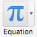
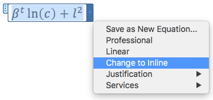

## How to enter math mode

There are two kinds of ways to display math on a page. You can either have *inline* math, which is part of the line that you type it in, like \(x^2 + {A \over B}\). Or you can have *display* math, which is centered and enlarged:

$$x^2 + {A \over B}$$

###### LyX

In LyX, you can insert an inline equation with the keyboard shortcut <b style="background-color: #eee8d5;">control m</b> or <b style="background-color: #eee8d5;">command m</b>, depending on your operating system. You can also insert an equation by selecting <b style="background-color: #eee8d5;">insert</b>, then <b style="background-color: #eee8d5;">math</b> in the menu or by clicking on the equation button at the top of the page:

For a display equation, the keyboard shortcuts are instead <b style="background-color: #eee8d5;">control shift m</b> or <b style="background-color: #eee8d5;">command shift m</b>. You can also switch an equation's mode by selecting that equation and then pressing this button at the bottom of the page:

###### Microsoft Office

In Microsoft Office, you can create an equation by clicking <b style="background-color: #eee8d5;">insert</b>, then <b style="background-color: #eee8d5;">equation</b>. You can also use the keyboard shortcut <b style="background-color: #eee8d5;">control =</b> or <b style="background-color: #eee8d5;">alt =</b>, depending on your version of Office.

You can then use a drop-down menu to switch an equation between inline and display mode.

###### Pure LaTeX

If you are typing in a pure LaTeX environment (like in Overleaf), you can use `\( x^2 \)` or `$ x^2 $` to insert an inline equation like this: \( x^2 \). And you can use `\[ x^2 \]` or `$$ x^2 $$` to insert a display-mode equation like this:

$$x^2$$

---

## Common Bits of Math

Below are a few examples for how to type math expressions. These examples only scratch the surface of what LaTeX math formatting can do, and [Overleaf has a helpful tutorial here.](https://www.overleaf.com/learn/latex/Mathematical_expressions)

### Subscripts and Superscripts

The carat symbol <b style="background-color: #eee8d5;">^</b> *(shift 6)* can be used to add a superscript, raising the next character up and making it smaller. Likewise, an underscore <b style="background-color: #eee8d5;">_</b> *(shift -)* can be used to add a subscript, lowering the next character.

In some software, if you want to include multiple characters in a superscript or subscript, you will need to use curly braces <b style="background-color: #eee8d5;">{ }</b>.

<table>
    <tr><th><b>Input:</b></th><th><b>Result:</b></th></tr>
    <tr><td>  x^2  </td><td>\(  x^2  \)</td></tr>
    <tr><td>  Q_d  </td><td>\(  Q_d  \)</td></tr>
    <tr><td>  A^B_C  </td><td>\(  A^B_C  \)</td></tr>
    <tr><td>  x^23  </td><td>\(  x^23  \)</td></tr>
    <tr><td>  x^{23}  </td><td>\(  x^{23}  \)</td></tr>
    <tr><td>  a^2 + b^2 = c^2  </td><td>\(  a^2 + b^2 = c^2  \)</td></tr>
</table>

### Greek Letters

To type a greek letter, first type a backslash <b style="background-color: #eee8d5;">\</b> *(near the enter key)* and then type the name of the letter. If you want a capital greek letter, capitalize the first character in the name.

<table>
    <tr><th><b>Input:</b></th><th><b>Result:</b></th></tr>
    <tr><td>  \gamma  </td><td>\(  \gamma  \)</td></tr>
    <tr><td>  \Gamma  </td><td>\(  \Gamma  \)</td></tr>
    <tr><td>  \alpha \beta \gamma  </td><td>\(  \alpha \beta \gamma  \)</td></tr>
    <tr><td>  \alpha^\beta_\gamma  </td><td>\(  \alpha^\beta_\gamma  \)</td></tr>
</table>

### Other common math symbols.

Typing other math symbols is very similar to typing greek letters. You just need to know the name of the symbol in LaTeX. I've included some of the most common symbols below. A more expansive list [can be found here](https://www.overleaf.com/learn/latex/List_of_Greek_letters_and_math_symbols). And if you know what a symbol looks like but don't know what it's called, [here's is a neat tool](http://detexify.kirelabs.org/classify.html) that lets you draw a symbol, and then gives you the LaTeX name for it.

Note that unlike greek letters, the names of these symbols are usually abbreviated to make them easier to type. For example, "**G**reater than or **EQ**ual to" is abbreviated to simply "\geq"

<table>
    <tr><th><b>Input:</b></th><th><b>Result:</b></th></tr>
    <tr><td>  \geq  </td><td>\(  \geq  \)</td></tr>
    <tr><td>  \leq  </td><td>\(  \leq  \)</td></tr>
    <tr><td>  \to  </td><td>\(  \to  \)</td></tr>
    <tr><td>  \partial  </td><td>\(  \partial  \)</td></tr>
    <tr><td>  \infty  </td><td>\(  \infty  \)</td></tr>
    <tr><td>  \times  </td><td>\(  \times  \)</td></tr>
    <tr><td>  \cdot  </td><td>\(  \cdot  \)</td></tr>
    <tr><td>  \sqrt{2}  </td><td>\(  \sqrt{2}  \)</td></tr>
</table>

### Weird Fancy Letters.

Oftentimes in math, you will see a symbol which looks like a normal letter, but written in a strange font. For example, \(\mathbb{R}\) is used to represent the real numbers, and \(\mathcal{L}\) is used as a symbol for Lagrangian optimization. These special fonts are called "Math **B**lackboard **B**old" and "Math **Cal**igraphy", and are abbreviated as mathbb and mathcal, respectively.

<table>
    <tr><th><b>Input:</b></th><th><b>Result:</b></th></tr>
    <tr><td>  \mathbb{R}  </td><td>\(  \mathbb{R} \)</td></tr>
    <tr><td>  \mathbb{ABCD} </td><td>\(  \mathbb{ABCD}  \)</td></tr>
    <tr><td>  \mathcal{L}  </td><td>\(  \mathcal{L}  \)</td></tr>
    <tr><td>  \mathcal{ABCD}  </td><td>\(  \mathcal{ABCD}  \)</td></tr>
</table>

### Fractions

There are a few different ways to type fractions, as you can see below:

<table>
    <tr><th><b>Input:</b></th><th><b>Result:</b></th></tr>
    <tr><td>  A/B  </td><td>\(  A/B  \)</td></tr>
    <tr><td>  A \over B  </td><td>\(  A \over B  \)</td></tr>
    <tr><td>  \frac{A}{B}  </td><td>\(  \frac{A}{B}  \)</td></tr>
</table>

In complex equations, curly braces can be used to control what is inside the fraction and what is not.

<table>
    <tr><th><b>Input:</b></th><th><b>Result:</b></th></tr>
    <tr><td>  A + B \over C  </td><td>\(  A + B \over C  \)</td></tr>
    <tr><td>  A + {B \over C}   </td><td>\(  A + {B \over C}   \)</td></tr>
    <tr><td>  A + {B \over C} \over D  </td><td>\(  A + {B \over C} \over D  \)</td></tr>
    <tr><td>  \frac{A+\frac{B}{C}}{D}  </td><td>\(  \frac{A+\frac{B}{C}}{D}  \)</td></tr>
</table>

### Limits, Integrals, and Sums

Some symbols have special formatting rules in display mode. For example, when we talk about the limit of a function as \(x\) approaches infinity, we want to place the symbols <b style="background-color: #eee8d5;">\(x\to\infty\)</b> directly underneath the <b style="background-color: #eee8d5;">\(\lim\)</b> symbol.

The following table shows three of these special symbols in inline mode:

<table>
    <tr><th><b>Input:</b></th><th><b>Result:</b></th></tr>
    <tr><td>  \lim_{x \to \infty}  </td><td>\(  \lim_{x\to\infty}  \)</td></tr>
    <tr><td>  \int_A^B   </td><td>\(    \int_A^B \)</td></tr>
    <tr><td>  \sum_{i=0}^N  </td><td>\(   \sum_{i=0}^N  \)</td></tr>
</table>

And here are those same symbols in display mode:

<table>
    <tr><th><b>Input:</b></th><th><b>Result:</b></th></tr>
    <tr><td>  \lim_{x \to \infty}  </td><td>\( \displaystyle \lim_{x \to \infty}  \)</td></tr>
    <tr><td>  \int_A^B   </td><td>\(  \displaystyle  \int_A^B \)</td></tr>
    <tr><td>  \sum_{i=0}^N  </td><td>\( \displaystyle  \sum_{i=0}^N  \)</td></tr>
</table>

